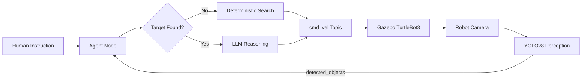
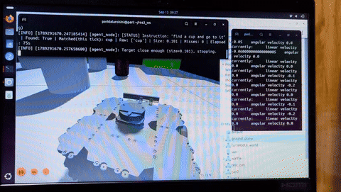

# 🤖 Agentic Autonomous Rover

> **An evolving autonomous robotics platform combining computer vision, agentic AI reasoning, ROS 2 and robot control — currently validated in simulation and being developed toward physical rover deployment.**

**Status:** 🚧 Active / Continuing Development  
**Current platform:** ROS 2 Jazzy + Gazebo Sim + TurtleBot3  
**Future physical platform:** DRISHTI rover

---

## Overview

The **Agentic Autonomous Rover** explores how a mobile robot can move beyond fixed waypoints and hard-coded task sequences by combining:

- **Visual perception** for understanding the robot's surroundings
- **Natural-language instructions** for high-level task specification
- **Agentic LLM reasoning** for context-aware local decisions
- **ROS 2** for modular robot-system communication
- **Deterministic control and safety logic** for execution-critical behaviour
- **Simulation-first development** before transition to physical hardware

The current prototype can receive an instruction such as:

```text
find a cup and go to it
```

The rover searches its environment, detects candidate objects through its camera, determines whether the requested target has been found, uses the reasoning layer to choose an approach direction, and drives toward the target until a deterministic arrival condition is satisfied.

This is **not a finished autonomous rover**. The current implementation is a foundation for continued development toward stronger navigation, richer perception, more capable agentic planning, and eventual integration with the **DRISHTI physical rover platform**.

---

## Project Vision

The long-term goal is to develop a robotics architecture in which:

**Human instruction**  
↓  
**Perception**  
↓  
**World / target understanding**  
↓  
**Agentic reasoning**  
↓  
**Navigation and action selection**  
↓  
**Deterministic control / safety**  
↓  
**Autonomous rover**

The main research and engineering interest is the **perception-to-reasoning interface**: how uncertain visual information and a high-level task can be transformed into grounded robot actions without allowing a probabilistic language model to directly control safety-critical behaviour.

---

## Current Architecture



The `/cmd_vel` topic is represented as `cmd_vel Topic` in the diagram so GitHub's Mermaid parser does not interpret the leading slash as shape syntax. GitHub supports Mermaid diagrams inside Markdown files when the syntax is valid. urlGitHub Mermaid diagram documentationhttps://docs.github.com/en/get-started/writing-on-github/working-with-advanced-formatting/creating-diagrams

### 1. Perception Layer

`detector_node` subscribes to the simulated camera stream:

```text
/camera/image_raw
```

The node:

1. Receives ROS image messages.
2. Converts them through `cv_bridge` into OpenCV frames.
3. Runs **YOLOv8n** using Ultralytics.
4. Filters detections below a confidence threshold of `0.5`.
5. Calculates a bounding-box area fraction as a rough proximity signal.
6. Publishes structured JSON detections to:

```text
/detected_objects
```

Each detection contains information such as:

```json
{
  "label": "cup",
  "confidence": 0.82,
  "size_fraction": 0.064
}
```

### 2. Agentic Reasoning Layer

`agent_node` combines:

- The current natural-language instruction
- Current visual detections
- Target matching information
- Target confirmation state

When a target is confirmed, the system sends the relevant context to the Gemini model and requests a structured action.

The model is constrained to return one of:

```text
move_forward
turn_left
turn_right
```

The response is parsed as JSON and converted into a robot motion command.

### 3. Deterministic Search

The rover does **not** call the LLM continuously while searching.

When the target is not visible, the current prototype uses a deterministic scan-and-advance behaviour. This makes exploration predictable, reduces unnecessary API calls, and keeps basic search behaviour independent of model availability.

### 4. Deterministic Safety Boundary

A major architectural decision in the current system is that the LLM **cannot issue the final stop command**.

Stopping is handled by deterministic system logic when:

- The target reaches the configured proximity threshold
- The operator enters `stop`
- The search exceeds its timeout

This separates probabilistic reasoning from a safety-sensitive control decision.

---

## Current Technology Stack

| Layer | Technology |
|---|---|
| Operating System | Ubuntu 24.04 |
| Robotics Middleware | ROS 2 Jazzy |
| Simulation | Gazebo Sim / `ros_gz` |
| Robot | TurtleBot3 simulation |
| Perception | YOLOv8n / Ultralytics |
| Image Processing | OpenCV |
| ROS Image Bridge | `cv_bridge` |
| Agent / Reasoning | Google Gemini API |
| Programming | Python 3.12 |
| Messaging | ROS 2 topics / `TwistStamped` |
| Version Control | Git / GitHub |

---

## Current Development Milestones

### Phase 1 — Environment and Robotics Setup

- ROS 2 Jazzy environment established
- Gazebo simulation configured
- TurtleBot3 simulation brought up
- Keyboard teleoperation verified
- Nav2 environment explored and autonomous navigation confirmed as a foundation for future integration

### Phase 2 — Perception

- Created the custom `rover_perception` ROS 2 package
- Connected the simulated camera
- Added YOLOv8 object detection
- Published structured detections through `/detected_objects`
- Added confidence filtering

### Phase 3 — Agent Layer

- Added interactive natural-language instructions
- Connected current detections to the agent node
- Added semantic/synonym grouping for commonly confused object classes
- Added target-confirmation hysteresis to tolerate intermittent missed detections
- Added structured JSON output constraints for the LLM

### Phase 4 — System Hardening

- Diagnosed the `TwistStamped` command interface rather than assuming the message type
- Added LLM failure fallback behaviour
- Reduced unnecessary LLM calls
- Added search timeout handling
- Added live decision/status logging
- Added deterministic arrival detection
- Added an immediate manual stop path

### Phase 5 — End-to-End Demonstration

The current simulated system demonstrates the complete cycle:

```text
Instruction
   ↓
Search
   ↓
Object detected
   ↓
Target confirmed
   ↓
Agentic approach decision
   ↓
Rover moves toward target
   ↓
Deterministic arrival check
   ↓
Stop
```

---

## Engineering Problems Solved

### ROS 2 command message mismatch

The robot command interface required `TwistStamped` rather than plain `Twist`. The issue was diagnosed through ROS topic inspection and independently verified with a manual ROS command before the complete pipeline was retested.

### Synthetic perception noise

The YOLO model was trained primarily on real-world imagery, while Gazebo provides simplified rendered scenes. This creates a practical simulation-domain perception problem.

The current system addresses this through:

- Confidence filtering
- Synonym grouping
- Target confirmation hysteresis

### LLM API efficiency

Calling the model on every decision cycle would be unnecessarily expensive and would introduce avoidable latency.

The architecture therefore uses:

> **Deterministic search → LLM only after target confirmation**

This keeps the search process local and reduces model calls to meaningful decision points.

### Graceful degradation

LLM/API failures are handled through exception handling and a fallback motion behaviour rather than allowing a temporary API or network problem to completely freeze the rover.

### Safety-related model behaviour

During development, the LLM could occasionally infer that the robot should stop before it had actually reached the target. Instead of trying to make the language model responsible for this safety-sensitive decision, the architecture was changed so that:

> **The LLM chooses approach direction; deterministic logic decides when to stop.**

This is an important design principle for the continuing development of the system.

### Simulation performance

Running Gazebo physics, perception and AI processing together can make the simulated clock slower than real time on the current hardware. This is currently treated as a documented system constraint while the project focuses on architecture and functionality.

---

## Current Status

| Component | Status | Current State |
|---|---|---|
| ROS 2 package | ✅ Implemented | Modular Python ROS 2 package |
| Camera perception | ✅ Implemented | Simulated camera → OpenCV |
| YOLOv8 detection | ✅ Implemented | Pretrained YOLOv8n |
| Detection filtering | ✅ Implemented | Confidence threshold |
| Target matching | ✅ Implemented | Semantic groups + hysteresis |
| Natural-language instruction | ✅ Implemented | Interactive terminal input |
| Agentic reasoning | ✅ Implemented | Gemini structured decisions |
| Deterministic search | 🟡 Prototype | Fixed scan-and-advance behaviour |
| Arrival detection | ✅ Implemented | Image-size proximity proxy |
| Obstacle-aware navigation | 🔵 Planned | Nav2 integration |
| Depth sensing | 🔵 Planned | Stereo/depth sensor direction |
| Frontier exploration | 🔵 Planned | Replace fixed search |
| Physical rover | 🔵 Planned | DRISHTI integration |
| Large-scale evaluation | 🔵 Planned | Repeatable trials + metrics |

---

## Known Limitations

The current prototype is intentionally limited and is being used as a foundation for continued development.

- Search is currently a fixed scan-and-advance pattern rather than frontier-based exploration.
- The current approach controller does not yet provide complete obstacle avoidance.
- Bounding-box size is only a rough 2D proximity estimate and is not true depth sensing.
- YOLO uses its pretrained default classes and has not yet been fine-tuned for the project's simulated environment.
- The current system is primarily validated through controlled simulation demonstrations rather than a large automated benchmark.
- The current repository does not yet contain the physical DRISHTI implementation.
- Simulation timing can degrade under the combined physics, perception and AI workload.

These limitations are **development targets**, not hidden gaps.

---

## Roadmap

### 🚧 Stage 1 — Strengthen the Simulation Stack

- Improve ROS 2 node architecture
- Improve perception robustness
- Add better state tracking
- Improve logging and reproducibility

### 🧭 Stage 2 — Navigation

- Integrate Nav2 more deeply
- Replace raw local motion with navigation goals
- Add obstacle-aware planning
- Improve localization and recovery behaviours

### 👁️ Stage 3 — Perception

- Add depth sensing
- Explore LiDAR integration
- Improve target localization
- Build a project-specific perception dataset
- Fine-tune detection models where necessary

### 🧠 Stage 4 — Agentic Intelligence

- Improve the perception-to-agent interface
- Maintain richer world/task state
- Move beyond single-step approach decisions
- Explore task decomposition and multi-step planning
- Introduce stronger action validation before execution

### 📊 Stage 5 — Evaluation

Develop repeatable experiments measuring:

- Target detection success
- Task completion rate
- Search time
- Approach time
- Arrival/proximity error
- Missed detections
- False detections
- LLM latency and failure recovery
- Navigation reliability

### 🔧 Stage 6 — Physical Rover

The validated simulation architecture will eventually be transferred to the **DRISHTI physical rover**.

The planned transition includes:

```text
Gazebo simulation
      ↓
ROS 2 interface validation
      ↓
Physical sensors
      ↓
Onboard compute
      ↓
DRISHTI rover
      ↓
Real-world perception
      ↓
Agentic reasoning
      ↓
Autonomous navigation
```

The physical stage will be treated as a new validation phase rather than assuming that simulation behaviour will transfer perfectly to hardware.

---

## DRISHTI Integration Direction

The long-term purpose of the current simulation is to establish a software architecture that can be transferred to a physical mobile platform.

The DRISHTI rover is intended to become that physical platform.

The integration will focus on:

- ROS 2 hardware interfaces
- Camera and additional sensor integration
- Onboard compute
- Physical velocity/control interfaces
- Real-time perception
- Agent-to-navigation interfaces
- Safety and command validation
- Controlled real-world experiments

The project is therefore progressing toward:

> **Simulation → Integrated software stack → Physical DRISHTI rover → Autonomous physical system**

> **DRISHTI GitHub repository:** _link to be added once the correct repository URL is provided._

---

## Repository Structure

```text
rover_project/
├── README.md
├── list_models.py
├── test_gemini.py
└── src/
    └── rover_perception/
        ├── package.xml
        ├── setup.py
        ├── setup.cfg
        ├── resource/
        │   └── rover_perception
        ├── rover_perception/
        │   ├── __init__.py
        │   ├── detector_node.py
        │   └── agent_node.py
        └── test/
            ├── test_copyright.py
            ├── test_flake8.py
            └── test_pep257.py
```

### Key Files

| File | Purpose |
|---|---|
| `detector_node.py` | Camera processing and YOLOv8 detection |
| `agent_node.py` | Instruction handling, target matching, reasoning and motion control |
| `package.xml` | ROS 2 package metadata and dependencies |
| `setup.py` | Python package configuration and ROS 2 entry points |
| `test_gemini.py` | Gemini connectivity/model test |
| `list_models.py` | Model listing utility |

---

## Installation

### Prerequisites

The current development environment is based on:

- Ubuntu 24.04
- ROS 2 Jazzy
- Gazebo Sim
- Python 3.12
- TurtleBot3 simulation

### Clone the repository

```bash
git clone https://github.com/ROHITH-chow06/rover_project.git
cd rover_project
```

### Build the ROS 2 package

```bash
source /opt/ros/jazzy/setup.bash
colcon build
source install/setup.bash
```

### Run the perception node

```bash
ros2 run rover_perception detector_node
```

### Run the agent node

```bash
ros2 run rover_perception agent_node
```

The exact simulation launch sequence may evolve as the navigation and hardware architecture is expanded.

---

## Example Interaction

A typical current interaction is:

```text
Instruction> find a cup and go to it
```

The system then:

1. Begins deterministic search behaviour.
2. Receives camera frames.
3. Runs YOLOv8 detection.
4. Publishes detected objects.
5. Checks whether the requested target has been found.
6. Confirms the target across detection frames.
7. Sends the relevant state to the agentic reasoning layer.
8. Receives a structured approach decision.
9. Publishes velocity commands.
10. Stops when the deterministic proximity condition is satisfied.

---

## Demo

A full simulated demonstration has been recorded showing the current end-to-end cycle:

**instruction → search → detection → target confirmation → agentic approach → arrival → stop**

### Demo GIF / Video

The README is prepared for a short animated GIF preview. Once the GIF is added to the repository at `assets/demo.gif`, it can be displayed directly in this section with:

```markdown
<p align="center">
  
</p>
```

For the full-resolution demonstration, add the actual video URL or repository video path when it is available:

```markdown
[▶️ Watch the full rover demonstration](YOUR_ACTUAL_VIDEO_LINK)
```

GitHub does not provide a reliable YouTube-style embedded player for an external video inside a repository README. A GIF preview plus a link to the full video is therefore the cleanest README presentation. GitHub also supports Mermaid diagrams directly in Markdown files. urlGitHub Markdown and Mermaid documentationhttps://docs.github.com/en/repositories/working-with-files/using-files/working-with-non-code-files

---

## Design Principles

### 1. Simulation first, hardware second

The system is being developed and debugged in simulation before being transferred to the DRISHTI physical platform.

### 2. AI assists; deterministic logic constrains

The language model is useful for interpreting context and selecting an approach action, but it is not treated as the authority for safety-critical stopping.

### 3. Modular ROS 2 architecture

Perception, reasoning and control are separated into components that communicate through ROS 2 interfaces.

### 4. Failures are part of development

Message mismatches, perception errors, API failures and simulation constraints are documented because they reveal the engineering work required for robust autonomy.

### 5. The project remains open-ended

The current implementation is a foundation. Navigation, sensing, agentic planning, evaluation and physical deployment are all active development directions.

---

## Project Status

> **This project is actively being built.**
>
> The current simulation demonstrates the core perception → reasoning → action loop. The next development stages are focused on improving navigation, perception, safety, evaluation and eventually transferring the architecture to the DRISHTI physical rover.

---

## License

License information will be added as the project is prepared for broader distribution.
